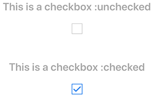
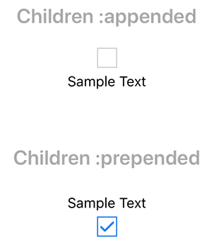
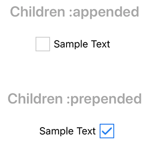
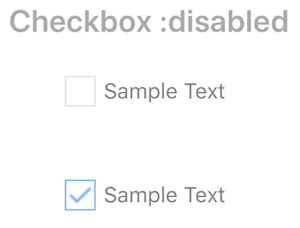
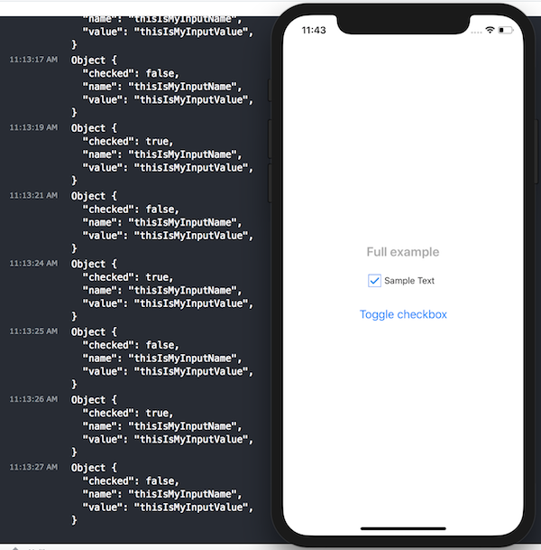

# React Native CheckBox component

## Installation

## Usage example

```javascript
import CheckBox from './src/components/CheckBox';
```

```javascript
<CheckBox />
```

## API

| Property            | Optional | Default  | Description                                |
| ------------------- | -------- | -------- | ------------------------------------------ |
| style               | yes      | empty    | style for a container                      |
| disabled            | yes      | false    | whether checkbox disabled or not           |
| name                | yes      | empty    | input name                                 |
| value               | yes      | empty    | input value                                |
| checked             | yes      | false    | whether the input checked or not initially |
| onChange            | yes      | empty    | function to call on change event           |
| content             | yes      | 'append' | 'append' or 'prepend' children             |
| componentChecked    | yes      | default  | input checked view                         |
| componentNotChecked | yes      | default  | input not checked view                     |

## Examples

### Checked property



```javascript
import React from 'react';
import { StyleSheet, Text, View } from 'react-native';
import CheckBox from './src/components/CheckBox';

const Heading = ({title}) => (
  <Text style={{fontSize: 20, fontWeight: 'bold', color: '#AAA', marginTop: 30}}>{title}</Text>
);

export default class App extends React.Component {
  render() {
    return (
      <View style={styles.container}>
        <Heading title="This is a checkbox :unchecked" />
        <CheckBox />
        <Heading title="This is a checkbox :checked" />
        <CheckBox checked={true} />
      </View>
    );
  }
}

const styles = StyleSheet.create({
  container: {
    flex: 1,
    backgroundColor: '#fff',
    alignItems: 'center',
    justifyContent: 'center',
  },
});

```

### Content property



```javascript
import React from 'react';
import { StyleSheet, Text, View } from 'react-native';
import CheckBox from './src/components/CheckBox';

const Heading = ({title}) => (
  <Text style={{fontSize: 20, fontWeight: 'bold', color: '#AAA', marginTop: 30}}>{title}</Text>
);

export default class App extends React.Component {
  render() {
    return (
      <View style={styles.container}>
        <Heading title="Children :appended" />
        <CheckBox content='append'>
          <Text style={{padding: 5}}>Sample Text</Text>
        </CheckBox>
        <Heading title="Children :prepended" />
        <CheckBox checked={true} content='prepend'>
          <Text style={{padding: 5}}>Sample Text</Text>
        </CheckBox>
      </View>
    );
  }
}

const styles = StyleSheet.create({
  container: {
    flex: 1,
    backgroundColor: '#fff',
    alignItems: 'center',
    justifyContent: 'center',
  },
});

```

### Container style

> This is a previous example with styled container



```javascript
import React from 'react';
import { StyleSheet, Text, View } from 'react-native';
import CheckBox from './src/components/CheckBox';

const Heading = ({title}) => (
  <Text style={{fontSize: 20, fontWeight: 'bold', color: '#AAA', marginTop: 30}}>{title}</Text>
);

export default class App extends React.Component {
  render() {
    return (
      <View style={styles.container}>
        <Heading title="Children :appended" />
        <CheckBox content='append' style={{flexDirection: 'row'}}>
          <Text style={{padding: 5}}>Sample Text</Text>
        </CheckBox>
        <Heading title="Children :prepended" />
        <CheckBox checked={true} content='prepend' style={{flexDirection: 'row'}}>
          <Text style={{padding: 5}}>Sample Text</Text>
        </CheckBox>
      </View>
    );
  }
}

const styles = StyleSheet.create({
  container: {
    flex: 1,
    backgroundColor: '#fff',
    alignItems: 'center',
    justifyContent: 'center',
  },
});

```

### Disabled checkbox



```javascript
  ...
  render() {
    return (
      <View style={styles.container}>
        <Heading title="Checkbox :disabled" />
        <CheckBox disabled style={{flexDirection: 'row'}}>
          <Text style={{padding: 5}}>Sample Text</Text>
        </CheckBox>
        <CheckBox disabled={true} style={{flexDirection: 'row'}} checked={true}>
          <Text style={{padding: 5}}>Sample Text</Text>
        </CheckBox>
      </View>
    );
  }
  ...
```

### name, value & onChange properties



```javascript
import React from 'react';
import { StyleSheet, Text, View, Button } from 'react-native';
import CheckBox from './src/components/CheckBox';

const Heading = ({title}) => (
  <Text style={{fontSize: 20, fontWeight: 'bold', color: '#AAA', marginTop: 30}}>{title}</Text>
);

export default class App extends React.Component {

  constructor() {
    super();
    this.state = {
      checked: true,
    };
  }

  onChange(input) {
    console.log(input);
  }

  onPress() {
    this.setState({
      checked: !this.state.checked
    });
  }

  render() {
    return (
      <View style={styles.container}>
        <Heading title="Full example" />
        <CheckBox content='append' style={{flexDirection: 'row'}} checked={this.state.checked} name='thisIsMyInputName' value='thisIsMyInputValue' onChange={this.onChange.bind(this)}>
          <Text style={{padding: 5}}>Sample Text</Text>
        </CheckBox>
        <Button onPress={this.onPress.bind(this)} title='Toggle checkbox' />
      </View>
    );
  }
}

const styles = StyleSheet.create({
  container: {
    flex: 1,
    backgroundColor: '#fff',
    alignItems: 'center',
    justifyContent: 'center',
  },
});
```

#### Console output on change is:
```bash
Object {
  "checked": false,
  "name": "thisIsMyInputName",
  "value": "thisIsMyInputValue",
}
```

### Custom CheckBox

You can create your custom view using componentChecked and componentNotChecked properties. See the example below:

```javascript
import React from 'react';
import { StyleSheet, Text, View } from 'react-native';
import CheckBox from './src/components/CheckBox';

const ComponentChecked = (props) => (
  <View style={{padding: 10, borderRadius: 6, backgroundColor: 'blue'}}>
    <Text style={{color: '#FFF'}}>{props.label}</Text>
  </View>
);
const ComponentNotChecked = (props) => (
  <View style={{padding: 10, borderRadius: 6, backgroundColor: '#f2f2f2'}}>
    <Text style={{color: '#333'}}>{props.label}</Text>
  </View>
);

const Heading = ({title}) => (
  <Text style={{fontSize: 20, fontWeight: 'bold', color: '#AAA', marginTop: 30}}>{title}</Text>
);

export default class App extends React.Component {
  constructor() {
    super();
    this.state = {
      loremChecked: true,
    };
  }

  onChange_1(...props) {
    console.log(props);
  }

  onChange_2(param, input) {
    console.log(param);
    console.log(input);
  }

  render() {
    return (
      <View style={styles.container}>

        <Heading title="Example 1" />
        <CheckBox style={{flexDirection: 'row'}} checked={false} onChange={this.onChange_1.bind(this, 'Param 1')} componentChecked={<Text>C H E C K E D</Text>} componentNotChecked={<Text>N O T   C H E C K E D</Text>}>
          <Text style={{paddingLeft: 20}}>Lorem ipsum</Text>
        </CheckBox>

        <Heading title="Example 2" />
        <CheckBox checked onChange={this.onChange_2.bind(this, 'Param 1')} componentChecked={<ComponentChecked label="Checked" />} componentNotChecked={<ComponentNotChecked label="Not Checked" />} />

      </View>
    );
  }
}

const styles = StyleSheet.create({
  container: {
    flex: 1,
    backgroundColor: '#fff',
    alignItems: 'center',
    justifyContent: 'center',
  },
});

```
